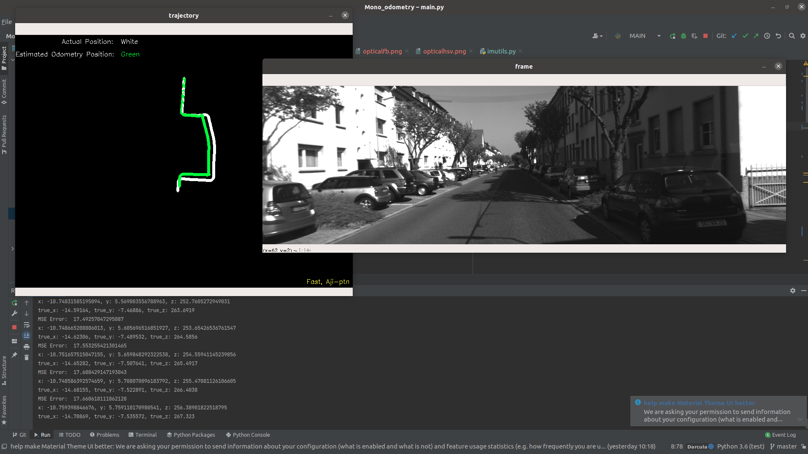
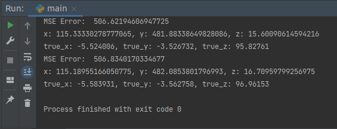
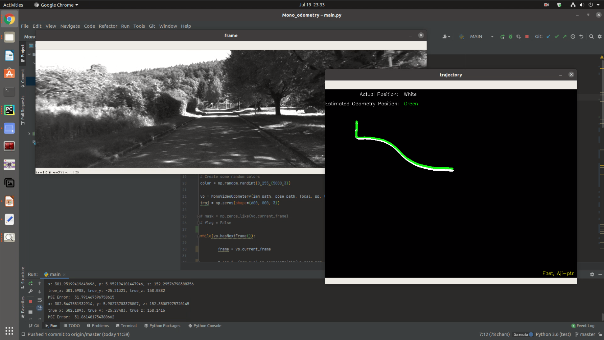

# Mono Visual Odometry using Kitti dataset

# Algorithm
Steps of the algorithm are taken from Avi Singh's blog post mentioned above. 
1. Capture images: I<sup>t</sup> and I<sup>t + 1</sup>
2. Undistort the captured images (not necessary for KITTI dataset)
3. Use FAST algorithm to detect features in image I<sup>t</sup>. Track these features using an optical flow methodology, remove points that fall out of frame or are not visible in I<sup>t + 1</sup>. Trigger a new detection of points if the number of tracked points falls behind a threshold. Set to 2000 in this implementation. 
4. Apply Nister's 5-point algorithm with RANSAC to find the essential matrix.
5. Estimate R, t from the essential matrix that was computed from Nister's algorithm.
6. Obtain scale information from an external source and concatenate translation vectors t and rotation matrices R.

For each of the steps above, the line of code is provided to the exact location where this step is preformed in the code for easy understanding. Steps 1 and 2 are skipped as they are not necessary in the KITTI dataset.

The dataset used is: [KITTI Visual Odometry](http://www.cvlibs.net/datasets/kitti/eval_odometry.php)

Or you can use this link to download [this dataset link](https://mcut-my.sharepoint.com/:f:/g/personal/m09158022_o365_mcut_edu_tw/EvVz4l8UCB1Pp3vxAP9tlXIB0UxbmyCjVTn5ITFxAVOV0Q?e=iaCoiS)
1. [image sequence](https://s3.eu-central-1.amazonaws.com/avg-kitti/data_odometry_gray.zip)
2. [pose image](https://s3.eu-central-1.amazonaws.com/avg-kitti/data_odometry_poses.zip)
# Requirement

1. Python 3.**
2. opencv-python
3. numpy
# Running Program
1. First clone repository
   
```buildoutcfg
$ git clone https://github.com/aji-ptn/Mono_odometry.git
```
2. In `main.py` change `img_path` and `pose_path` to correct image sequences and pose file paths in **line 7 and 8**
   
```buildoutcfg
img_path = '/home/aji/Documents/Dataset/data_odometry_gray/dataset/sequences/00/image_0/'
pose_path = '/home/aji/Documents/Dataset/data_odometry_poses/dataset/poses/00.txt'
```
3. Ensure focal length and principal point information is correct
   
```buildoutcfg
focal = 718.8560  # focal length
pp = (607.1928, 185.2157)  # principal point
```
4. Adjust Lucas Kanade Parameters as needed **(line 16 in main.py)**
   
```buildoutcfg
lk_params = dict(winSize=(21, 21), criteria=(cv.TERM_CRITERIA_EPS | cv.TERM_CRITERIA_COUNT, 30, 0.01))
```
5. Run command 
   
```buildoutcfg
main.py
````
# Result




## You can click [this video](https://www.youtube.com/watch?v=vASenN5PiPc)
[](https://www.youtube.com/watch?v=vASenN5PiPc)

# Reference
An invaluable resource I used in building the visual odometry system was Avi Singh's blog post: http://avisingh599.github.io/vision/monocular-vo/ as well as his C++ implementation found [here](https://github.com/avisingh599/mono-vo).
